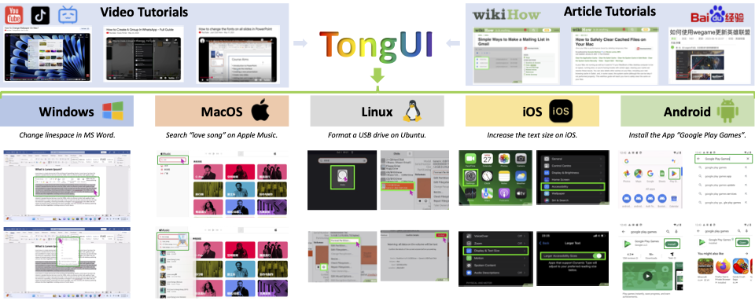

# TongUI

Training Vision-Language-Action(VLA) Model for GUI & Computer Use tasks by watching online tutorials. Fully open-sourced dataset, model and training pipeline. Cost efficient solution for GUI task data generation.

针对图形操作界面任务设计的VLA模型和智能体框架。

<p align="center">
        &nbsp&nbsp 📑 <a href="https://arxiv.org/abs/2504.12679">Paper</a> &nbsp&nbsp 
        | 🤗 <a href="https://huggingface.co/collections/Bofeee5675/tongui-67f611e2d48b2b6e0d2ba3ee">Hugging Collections (Models & Datasets)</a>&nbsp&nbsp 
        | &nbsp&nbsp 🤗 <a href="https://huggingface.co/spaces/Bofeee5675/TongUI">Spaces Demo</a> &nbsp&nbsp | &nbsp&nbsp 🌐 <a href="https://tongui-agent.github.io/">Webpage</a>
</p>

> [**TongUI: Building Generalized GUI Agents by Learning from Multimodal Web Tutorials**](https://arxiv.org/abs/2504.12679)<br>
> [Bofei Zhang*](https://bofei5675.github.io/), [Zirui Shan*](), [Zhi Gao*](https://zhigao2017.github.io/), [Wang Zhang](), [Rui Xie](), [Xiaojian Ma](https://jeasinema.github.io/), [Yuan Tao](https://i.yt.sb/), [Xinxiao Wu](), [Song-Chun Zhu](https://www.zhusongchun.net/), [Qing Li✉](https://liqing.io/)

<p align="center">

<p>

## 🌟 Updates
- [ ] Training Qwen2.5-VL-32B model and release weights.
- [ ] Release all experiments/evaluation scripts [WIP].
- [x] [2025.05.06] Release [**TongUI-7B**](https://huggingface.co/Bofeee5675/TongUI-7B) model and [**TongUI-1M**](https://huggingface.co/datasets/Bofeee5675/TongUI-1M) dataset.
- [x] [2025.04.21] Release 🔧 Training pipeline.
- [x] [2025.04.17] Release [**TongUI-3B**](https://huggingface.co/Bofeee5675/TongUI-3B) model and [**143K training dataset**](https://huggingface.co/datasets/Bofeee5675/TongUI-143K/tree/main).  

## 📊 Performance
Key findings
- Training with this cost-efficient dataset gives **SOTA👑** performance on Multiple GUI benchmarks!
- Training with 1M version of dataset make the performance **scale up🚀**!

*Results on ScreenSpot; † means the results are re-produced. We report results on six splits of ScreenSpot and the average scores. The best method is marked in bold. 1M means the dataset is 1M version.*

| Model | Data Num | Data Size | Desktop Icon | Desktop Text | Mobile Icon | Mobile Text | Web Icon | Web Text | Average |
|-------|----------|-----------|--------------|--------------|-------------|-------------|----------|----------|---------|
| SeeClick-9.6B | 364K | - | 30.0 | 72.2 | 52.0 | 78.0 | 32.5 | 55.7 | 53.4 |
| UGround-7B | 1.3M | - | 63.6 | 82.5 | 60.3 | 82.8 | 80.4 | 73.3 | 70.4 |
| OmniParser-GPT-4V | - | - | 63.6 | 91.3 | 57.0 | 93.9 | 51.0 | 81.3 | 73.0 |
| ShowUI-2B | 256K | 0.72B | 61.1 | 76.3 | 75.5 | 92.3 | 63.6 | 81.7 | 75.1 |
| Qwen2.5-VL-3B † | - | - | 7.8 | 22.2 | 5.2 | 8.4 | 1.7 | 2.4 | 8.0 |
| Qwen2.5-VL-7B † | - | - | 16.4 | 26.8 | 5.2 | 6.6 | 7.3 | 13.0 | 12.6 |
| TongUI-3B | 399K | 1.24B | 68.5 | 86.5 | 76.0 | 90.5 | 68.4 | 87.4 | 79.6 |
| TongUI-7B | 399K | 1.24B | 75.0 | 91.2 | 79.9 | 93.0 | 72.3 | 88.7 | 83.4 |
| TongUI-3B(1M) | 1.3M | - | 77.1 | 92.3 | 77.7 | 92.6 | 74.8 | 87.8 | 83.6 |
| TongUI-7B(1M) | 1.3M | - | **80.0** | **93.8** | **79.5** | **91.9** | **81.6** | **89.1** | **86.0** |

*Results on Mind2Web. We report results on three types of tasks: cross-task, cross-website, and cross-domain. Elem. Acc means whether the element is selected correctly, OP. F1 denotes the F1 score for the predicted action, and Step SR counts successful steps. 1M means the dataset is 1M version.*

| Method | Cross-Task | | | Cross-Website | | | Cross-Domain | | |
|--------|------------|------------|------------|---------------|------------|------------|--------------|------------|------------|
| | Elem. Acc | OP. F1 | Step SR | Elem. Acc | OP. F1 | Step SR | Elem. Acc | OP. F1 | Step SR |
| CogAgent | 22.4 | 53.0 | 17.6 | 18.4 | 42.4 | 13.4 | 20.6 | 42.0 | 15.5 |
| MindAct | 55.1 | 75.7 | 52.0 | 42.0 | 65.2 | 38.9 | 42.1 | 66.5 | 39.6 |
| OmniParser | 42.4 | 87.6 | 39.4 | 41.0 | 84.8 | 36.5 | 45.5 | 85.7 | 42.0 |
| ShowUI-2B | 39.9 | 88.6 | 37.2 | 41.6 | 83.5 | 35.1 | 39.4 | 86.8 | 35.2 |
| SeeClick-9.6B | 28.3 | 87.0 | 25.5 | 21.4 | 80.6 | 16.4 | 23.2 | 84.8 | 20.8 |
| Qwen2.5-VL-3B † | 2.5 | 14.5 | 0.4 | 2.7 | 12.6 | 1.0 | 3.3 | 24.2 | 1.7 |
| Qwen2.5-VL-7B † | 6.2 | 72.8 | 5.0 | 6.3 | 68.2 | 4.5 | 8.4 | 73.6 | 7.2 |
| Qwen2.5-VL-3B-ShowUI | 43.2 | 88.7 | 39.7 | 41.3 | 86.7 | 35.5 | 45.1 | 86.1 | 40.7 |
| TongUI-3B | 48.0 | 88.4 | 44.2 | 48.9 | 85.4 | 42.6 | 50.0 | 87.7 | 46.0 |
| TongUI-7B | 51.1 | 88.7 | 46.9 | 50.4 | 87.5 | 43.7 | 53.9 | 88.6 | 49.1 |
| TongUI-3B(1M) | 53.4 | 89.0 | 48.8 | 54.2 | 86.4 | 48.1 | 53.8 | 88.2 | 49.5 |
| TongUI-7B(1M) | **58.1** | **88.7** | **53.4** | **55.6** | **87.2** | **49.0** | **57.6** | **88.7** | **52.9** |

For other experiments, please refer to [our paper](https://arxiv.org/abs/2504.12679).
## 👋 Getting Started
We use [uv](https://docs.astral.sh/uv/getting-started/) to manage the dependencies.
```bash
uv sync --all-groups
```
To using `conda` and `pip` to install the dependencies.
```bash
conda create -n tongui python=3.12
conda activate tongui
pip install -e .
```

To execute any script by `uv`, you can use the following command.
```bash
uv run <script_name>.py
```
Just replace `uv` with python if you are using `conda` or `pip` to install the dependencies.
```bash
python <script_name>.py
```

### Gradio Demo (Local or Online)
We host an online Gradio Demo on [Hugging Face Spaces](https://huggingface.co/spaces/Bofeee5675/TongUI). Please feel free to try it. We also open source the code for this demo. Feel free to run it locally.
```bash
git clone https://huggingface.co/spaces/Bofeee5675/TongUI
cd TongUI
uv run app.py
```

### API Calling
You can programatically call the TongUI API by using the following code.
```bash
uv run examples/api.py
```

### Serve Model By vLLM
You can serve the model by `vLLM`.
```bash
uv run vllm serve Bofeee5675/TongUI-3B --port 8000 --served-model-name tongui-3b --limit-mm-per-prompt image=3
```

Then, you can use openai compatible API to call the model. Checkout `examples/call_vllm.py` for more details.
```bash
uv run examples/call_vllm.py
```
### Local Model
Checkout `examples/inference.py` for local inference.
```bash
uv run examples/inference.py
```
<!-- ## Advanced Example
Above examples are for basic usage of TongUI, which demonstrates a simple task for GUI element grounding. To address multi-turn navigation tasks, Checkout examples: -->

## 🔧 Training Details
For detailed information about model training, including hyperparameters, data preprocessing, and training configurations, please refer to our [Training Documentation](docs/train.md).

## 📚 Experiments
For comprehensive experimental results, ablation studies, and evaluation details, please check our [Experiments Documentation](docs/experiments.md).

## 🌟 Star History

[](https://www.star-history.com/#TongUI-agent/TongUI-agent&Date)

# Acknowledgement
We thank the following projects for their wonderful works.
- We adopt experiments, data preprocessing pipeline from  [ShowUI](https://github.com/showlab/ShowUI)
- We train our model by using [LLaMA-Factory](https://github.com/hiyouga/LLaMA-Factory/tree/main?tab=readme-ov-file)
- Thanks for [Qwen2.5-VL series](https://github.com/QwenLM/Qwen2-VL) model and [UI-TARS](https://github.com/bytedance/UI-TARS) for their great work.

# Citation 
If you find this work useful in your research, please consider citing:
```
@article{zhang2025tongui,
  title={TongUI: Building Generalized GUI Agents by Learning from Multimodal Web Tutorials},
  author={Zhang, Bofei and Shang, Zirui and Gao, Zhi and Zhang, Wang and Xie, Rui and Ma, Xiaojian and Yuan, Tao and Wu, Xinxiao and Zhu, Song-Chun and Li, Qing},
  journal={arXiv preprint arXiv:2504.12679},
  year={2025}
}
```