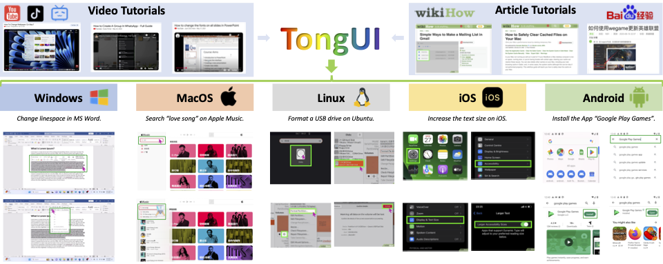

<div align="center" style="display: flex; align-items: center; justify-content: center; gap: 16px;">
  
  <span style="font-size: 3rem; font-weight: bold; color: #dbeafe;">TongUI</span>
</div>

---


Training Vision-Language-Action(VLA) Model for GUI & Computer Use tasks by watching online tutorials. Fully open-sourced dataset, model and training pipeline. Cost efficient solution for GUI task data generation.

针对图形操作界面任务设计的VLA模型和智能体框架。

<p align="center">
        &nbsp&nbsp 📑 <a href="https://arxiv.org/abs/2504.12679">Paper</a> &nbsp&nbsp 
        | 🤗 <a href="https://huggingface.co/collections/Bofeee5675/tongui-67f611e2d48b2b6e0d2ba3ee">HuggingFace Collections (Models & Datasets)</a>&nbsp&nbsp
        | 🤖 <a href="http://modelscope.cn/collections/TongUI-158b10bdaf1046">ModelScope Collections (Models & Datasets)</a>&nbsp&nbsp 
        | &nbsp&nbsp 🤗 <a href="https://huggingface.co/spaces/Bofeee5675/TongUI">Spaces Demo</a> &nbsp&nbsp | &nbsp&nbsp 🌐 <a href="https://tongui-agent.github.io/">Webpage</a>
</p>

> [**TongUI: Building Generalized GUI Agents by Learning from Multimodal Web Tutorials**](https://arxiv.org/abs/2504.12679)<br>
> [Bofei Zhang*](https://bofei5675.github.io/), [Zirui Shan*](), [Zhi Gao*](https://zhigao2017.github.io/), [Wang Zhang](), [Rui Xie](), [Xiaojian Ma](https://jeasinema.github.io/), [Yuan Tao](https://i.yt.sb/), [Xinxiao Wu](), [Song-Chun Zhu](https://www.zhusongchun.net/), [Qing Li✉](https://liqing.io/)

<p align="center">

<p>

<div align="center" markdown="1">

### Supporters ❤️

<a href="https://www.datacanvas.com/">
    
</a>

#### [Training TongUI-3B/7B/32B with DataCanvas(九章云极)](https://www.datacanvas.com/)
</div>

## 🌟 Updates

- [ ] Release all experiments/evaluation scripts [WIP].
- [x] [2025.05.27] Release [**TongUI-32B**](https://huggingface.co/Bofeee5675/TongUI-32B) model and [Training Details](docs/train.md).
- [x] [2025.05.06] Release [**TongUI-7B**](https://huggingface.co/Bofeee5675/TongUI-7B) model and [**GUI-Net-1M**](https://huggingface.co/datasets/Bofeee5675/GUI-Net-1M) dataset.
- [x] [2025.04.21] Release 🔧 Training pipeline.
- [x] [2025.04.17] Release [**TongUI-3B**](https://huggingface.co/Bofeee5675/TongUI-3B) model.  

## 📊 Performance
Key findings
- Training with this cost-efficient dataset gives **SOTA👑** performance on Multiple GUI benchmarks!
- Training with 1M version of dataset make the performance **scale up🚀**!

*Results on ScreenSpot; † means the results are re-produced. We report results on six splits of ScreenSpot and the average scores. The best method is marked in bold. 1M means the dataset is 1M version.*

| Model | Data Num | Data Size | Desktop Icon | Desktop Text | Mobile Icon | Mobile Text | Web Icon | Web Text | Average |
|-------|----------|-----------|--------------|--------------|-------------|-------------|----------|----------|---------|
| SeeClick-9.6B | 364K | - | 30.0 | 72.2 | 52.0 | 78.0 | 32.5 | 55.7 | 53.4 |
| UGround-7B | 1.3M | - | 63.6 | 82.5 | 60.3 | 82.8 | 80.4 | 73.3 | 70.4 |
| OmniParser-GPT-4V | - | - | 63.6 | 91.3 | 57.0 | 93.9 | 51.0 | 81.3 | 73.0 |
| ShowUI-2B | 256K | 0.72B | 61.1 | 76.3 | 75.5 | 92.3 | 63.6 | 81.7 | 75.1 |
| Qwen2.5-VL-3B † | - | - | 7.8 | 22.2 | 5.2 | 8.4 | 1.7 | 2.4 | 8.0 |
| Qwen2.5-VL-7B † | - | - | 16.4 | 26.8 | 5.2 | 6.6 | 7.3 | 13.0 | 12.6 |
| TongUI-3B | 399K | 1.24B | 68.5 | 86.5 | 76.0 | 90.5 | 68.4 | 87.4 | 79.6 |
| TongUI-7B | 399K | 1.24B | 75.0 | 91.2 | 79.9 | 93.0 | 72.3 | 88.7 | 83.4 |
| TongUI-3B(1M) | 1.3M | - | 77.1 | 92.3 | 77.7 | 92.6 | 74.8 | 87.8 | 83.6 |
| TongUI-7B(1M) | 1.3M | - | **80.0** | **93.8** | **79.5** | **91.9** | **81.6** | **89.1** | **86.0** |

*Results on Mind2Web. We report results on three types of tasks: cross-task, cross-website, and cross-domain. Elem. Acc means whether the element is selected correctly, OP. F1 denotes the F1 score for the predicted action, and Step SR counts successful steps. 1M means the dataset is 1M version.*

| Method | Cross-Task | | | Cross-Website | | | Cross-Domain | | |
|--------|------------|------------|------------|---------------|------------|------------|--------------|------------|------------|
| | Elem. Acc | OP. F1 | Step SR | Elem. Acc | OP. F1 | Step SR | Elem. Acc | OP. F1 | Step SR |
| CogAgent | 22.4 | 53.0 | 17.6 | 18.4 | 42.4 | 13.4 | 20.6 | 42.0 | 15.5 |
| MindAct | 55.1 | 75.7 | 52.0 | 42.0 | 65.2 | 38.9 | 42.1 | 66.5 | 39.6 |
| OmniParser | 42.4 | 87.6 | 39.4 | 41.0 | 84.8 | 36.5 | 45.5 | 85.7 | 42.0 |
| ShowUI-2B | 39.9 | 88.6 | 37.2 | 41.6 | 83.5 | 35.1 | 39.4 | 86.8 | 35.2 |
| SeeClick-9.6B | 28.3 | 87.0 | 25.5 | 21.4 | 80.6 | 16.4 | 23.2 | 84.8 | 20.8 |
| Qwen2.5-VL-3B † | 2.5 | 14.5 | 0.4 | 2.7 | 12.6 | 1.0 | 3.3 | 24.2 | 1.7 |
| Qwen2.5-VL-7B † | 6.2 | 72.8 | 5.0 | 6.3 | 68.2 | 4.5 | 8.4 | 73.6 | 7.2 |
| Qwen2.5-VL-3B-ShowUI | 43.2 | 88.7 | 39.7 | 41.3 | 86.7 | 35.5 | 45.1 | 86.1 | 40.7 |
| TongUI-3B | 48.0 | 88.4 | 44.2 | 48.9 | 85.4 | 42.6 | 50.0 | 87.7 | 46.0 |
| TongUI-7B | 51.1 | 88.7 | 46.9 | 50.4 | 87.5 | 43.7 | 53.9 | 88.6 | 49.1 |
| TongUI-3B(1M) | 53.4 | 89.0 | 48.8 | 54.2 | 86.4 | 48.1 | 53.8 | 88.2 | 49.5 |
| TongUI-7B(1M) | **58.1** | **88.7** | **53.4** | **55.6** | **87.2** | **49.0** | **57.6** | **88.7** | **52.9** |

For other experiments, please refer to [our paper](https://arxiv.org/abs/2504.12679).
## 👋 Getting Started
We use [uv](https://docs.astral.sh/uv/getting-started/) to manage the dependencies.
```bash
uv sync --all-groups
```
To using `conda` and `pip`